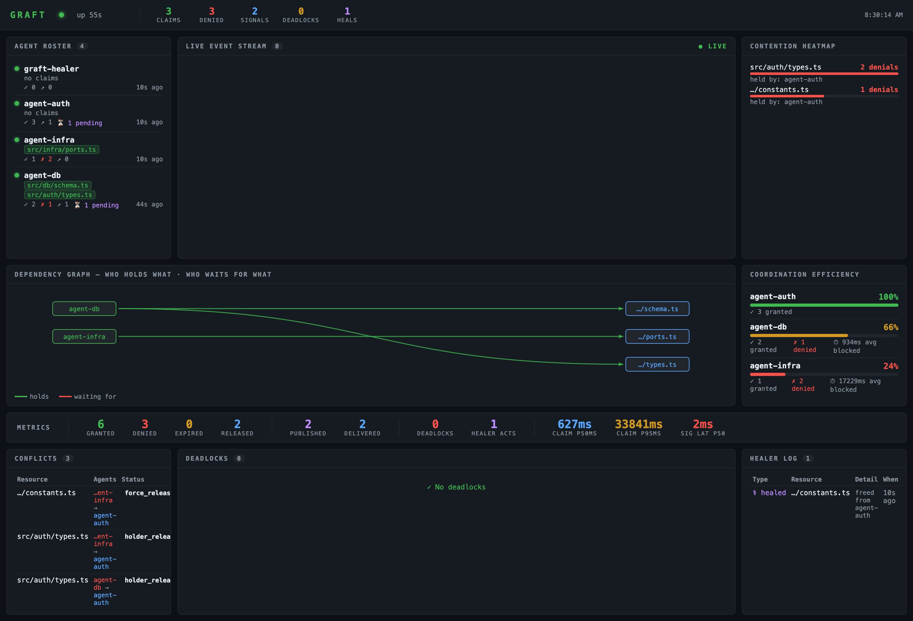
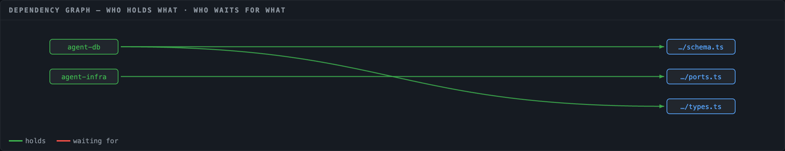
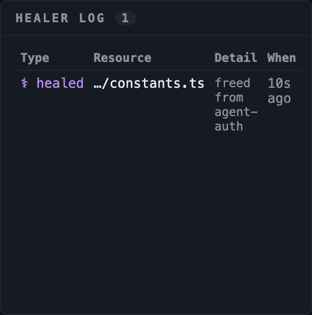

# Graft

Shared resource coordination layer for parallel AI coding agents.

Graft brings OS-level concurrency primitives — mutexes, event buses, semaphores, barriers — to the agent layer. Agents claim shared resources before touching them, broadcast signals mid-execution when they discover something others should know, and respond to incoming signals at each tool boundary. No orchestrator. No merge step. Conflicts surface at write time, not at merge time.

## Installation

### TypeScript/Node.js
```bash
npm install
npm run build
```

### Python
```bash
pip install .
```

## Quick Start

Start the Graft bus:
```bash
graft start
```

Copy the Claude Code hooks into your project:
```bash
graft install --claude-code
```

Run agents normally — Graft coordinates automatically via `PreToolUse` and `PostToolUse` hooks.

---

## What's New

### Line-Range Locking

Claims now support sub-file granularity. Two agents editing non-overlapping sections of the same file can proceed in parallel — only overlapping edits block each other.

```typescript
// Agent A claims only the lines it needs to change
await graft.claim({
  resourceId: 'src/auth/types.ts',
  intent: 'adding rateLimitedUntil to User interface',
  lineStart: 3,
  lineEnd: 10,
})

// Agent B claims a different section of the same file — granted immediately
await graft.claim({
  resourceId: 'src/auth/types.ts',
  intent: 'updating LoginPayload with mfaToken field',
  lineStart: 21,
  lineEnd: 27,
})
```

Overlap detection uses standard interval arithmetic: two ranges conflict only when `a.start <= b.end && b.start <= a.end`. A claim without a line range is a whole-file claim and blocks all other claims on that resource.

The Claude Code `Edit` hook automatically computes line ranges from `old_string` before the edit executes — no manual line numbers required.

**New SDK methods:**
- `claim({ lineStart, lineEnd })` — scoped claim on a line range
- `release(resourceId, lineStart, lineEnd)` — release a specific range
- `releaseById(claimId)` — release by UUID (precise, no ambiguity)
- `getClaims(resourceId)` — returns all active claims on a resource (multiple when non-overlapping ranges coexist)
- `getClaimById(claimId)` — look up a claim by its UUID

### Dashboard, Observability & Self-Healing

Graft ships a live web dashboard and a self-healing agent that watches the bus and resolves stuck coordination automatically.

#### Dashboard

Open [`http://localhost:7433/dashboard`](http://localhost:7433/dashboard) after `graft start`.



Nine panels update in real time via SSE + 3-second polling:

| Panel | What it shows |
|---|---|
| **Agent Roster** | Every agent — active claims (green tags), grant/deny counts, pending signals, last activity |
| **Live Event Stream** | Every audit event as it happens — color-coded by type |
| **Contention Heatmap** | Most-contested resources ranked by denial count |
| **Dependency Graph** | SVG DAG: who holds what, who is waiting — green = holds, red dashed = waiting |
| **Coordination Efficiency** | Per-agent score 0–100% based on block rate + avg blocked time |
| **Metrics Bar** | Granted/denied/expired/released + signal counts + claim hold p50/p95 + signal latency |
| **Conflicts** | All claim conflicts with resolution status and age |
| **Deadlocks** | Detected cycles and resolutions |
| **Healer Log** | Every starvation detection and force-release the healer performed |


*Live dependency graph during a 3-agent run. `agent-db` holds `schema.ts` and `types.ts`. `agent-infra` holds `ports.ts`. Resources with active waiters render in red.*

#### Self-Healing Agent

The bus runs a background `SelfHealer` that detects and resolves stuck coordination without operator intervention.

**What it detects:** starvation — a conflict that has been `pending` longer than `starvation_threshold_ms` (default 30s), meaning the holding agent crashed, hung, or is taking far longer than its declared TTL.

**What it does:**
1. Writes a `starvation_detected` audit event (visible in the SSE stream and Live Events panel)
2. If `auto_heal: true` (default): force-releases the held resource, writes a `healer_action` entry, unblocks any waiters


*Healer log: one force-release on `constants.ts` — the holding agent stopped heartbeating, starvation was detected at 30s, and the resource was freed.*

Configure in `graft.config.yaml`:

```yaml
healer:
  enabled: true
  interval_ms: 15000             # how often the healer checks (default: 15s)
  starvation_threshold_ms: 30000 # conflict age before action (default: 30s)
  auto_heal: true                # false = log only, no force-release
```

#### New observability endpoints

```
GET /dashboard               # Live web dashboard
GET /graph                   # Dependency DAG — nodes (agents + resources) + edges (holds / waiting_for)
GET /stats/efficiency        # Per-agent coordination efficiency scores
GET /metrics                 # Prometheus text format
GET /metrics?format=json     # Structured JSON metrics
GET /audit/stream            # SSE stream of every bus event in real time
GET /stats/contention        # Most-contested resources ranked by denial count
GET /agents                  # Live agent roster
```

Audit event types now include `starvation_detected` and `healer_action` — both appear in the SSE stream and are queryable via `/audit?type=starvation_detected`.

Every `AuditEntry` optionally carries `causedBySignalId` — when an agent acts in response to a received signal, the subsequent claim or release is linked to the originating signal, enabling causal chain reconstruction in post-mortem analysis.

**CLI commands:**
```bash
graft metrics                  # Prometheus metrics
graft agents                   # Agent roster
graft stats contention         # Contention heatmap
graft audit:stream             # Stream live audit events
```

**Simulate and screenshot:**
```bash
npm run simulate    # Spin up 3 synthetic agents with conflicts and signals
npm run screenshot  # Capture dashboard screenshots to docs/screenshots/
```

### Dead Agent Detection & Auto-Recovery

When an agent crashes without releasing its claims, the bus detects staleness via TTL expiry and auto-releases all its resources. You can also force-release manually:

```bash
graft claims release --agent crashed-agent-id
```

Or via SDK:
```typescript
await graft.forceReleaseAgent('crashed-agent-id')
```

Any agents blocking on `waitForRelease` for that resource are unblocked immediately.

### Auto-Subscribe on First Hook Call

Agents now auto-subscribe to the standard signal types (`change_summary`, `interface_change`, `schema_change`, `security_finding`, `new_utility`, `resource_conflict`) on their first `preToolUse` hook call. No manual subscription step required — an agent that starts work after another agent has already broadcast signals will still receive them correctly.

---

## Benchmark: Graft vs Sequential vs Git Worktrees

Measured on a real project (loginapp) with 5 independent tasks run three ways. Each task creates a new TypeScript source file.

| Approach | Time | Speedup |
|---|---|---|
| Sequential (baseline) | 37s | 1× |
| **Graft parallel** | **12s** | **3×** |
| Git worktree parallel | 19s | 1.9× |

**Graft is 7s faster than worktrees** even when there are zero conflicts between agents.

### Why Graft beats worktrees

Git worktree parallel time breaks down as:

```
Setup (create 5 branches + checkout):   1s
Parallel agent work:                    18s
Merge (cherry-pick 5 branches):          0s  ← lucky, no conflicts this time
Total:                                  19s
```

Graft parallel time:

```
Setup:                                   0s  ← agents start immediately
Parallel agent work:                    12s
Merge:                                   0s  ← already in shared directory
Total:                                  12s
```

Two structural reasons for the gap:

1. **Worktree agents start cold.** Each isolated worktree directory has its own copy of the repo. Every file read is a cache miss. Graft agents share the same working directory — the second agent to read a file hits the OS page cache.

2. **Conflicts surface at the wrong time.** Worktrees detect write conflicts at merge time, after all agents have finished. Graft detects them at write time, mid-execution. When agent B gets blocked by agent A's claim, it sees exactly what A is doing (`intent` field) and can decide immediately whether to wait, work on something else, or inform the user — instead of discovering a merge conflict hours later.

### Graft audit from the parallel run

Every tool call is coordinated through the bus. With 5 independent tasks, all 5 claims are granted immediately and all 5 agents run in parallel with zero blocking:

```
[16] claim_granted   par-3  [validators.ts]
[17] signal_published par-3
[18] claim_granted   par-4  [csrf.ts]
[19] signal_published par-4
[20] claim_granted   par-5  [Stats.tsx]
[21] signal_published par-5
[22] claim_granted   par-1  [Spinner.tsx]
[23] signal_published par-1
[24] claim_granted   par-2  [Avatar.tsx]
[25] signal_published par-2
```

Each agent also broadcasts a `change_summary` signal on completion, so every other agent is informed of what changed — no post-merge discovery.

### When worktrees win

Worktrees make sense when agents are deliberately working on completely separate branches of a codebase with no shared files and no need to communicate mid-run. Graft makes sense when agents share files, need to broadcast discoveries to each other, or when you want conflict detection before merge rather than after.

---

## Architecture

For full architecture documentation, see [docs/architecture.md](docs/architecture.md).

The short version: Graft is a lightweight HTTP bus (`localhost:7433`) that agents talk to via hooks or SDK. It tracks resource claims (with optional line-range granularity), routes signals between agents, manages resource pools, detects deadlocks, and exposes live observability surfaces. Every event is written to an append-only audit log.

```
Agent A ──POST /claims──► Bus ──denied──► Agent B sees intent, pivots
Agent A ──POST /signals──► Bus ──delivers at next hook boundary──► Agent C
Agent A ──DELETE /claims──► Bus ──notifies waiters──► Agent B proceeds

Bus ──GET /metrics──► Prometheus scraper
Bus ──GET /audit/stream──► SSE dashboard
Bus ──GET /stats/contention──► Bottleneck analysis
Bus ──GET /agents──► Fleet status
```

For configuration, adapters (Claude Code, OpenAI Agents SDK, MCP), and the full API reference, see [CLAUDE.md](CLAUDE.md).

---

## Testing

The test suite covers the full coordination stack end-to-end:

```bash
npm test
```

Includes unit tests for every bus module (registry, signals, pool, deadlock, audit, metrics) and integration tests that simulate real parallel agent scenarios — including a two-agent sprint against the loginapp codebase with file contention, port pool exhaustion, wave gate synchronization, and conflict log verification.
