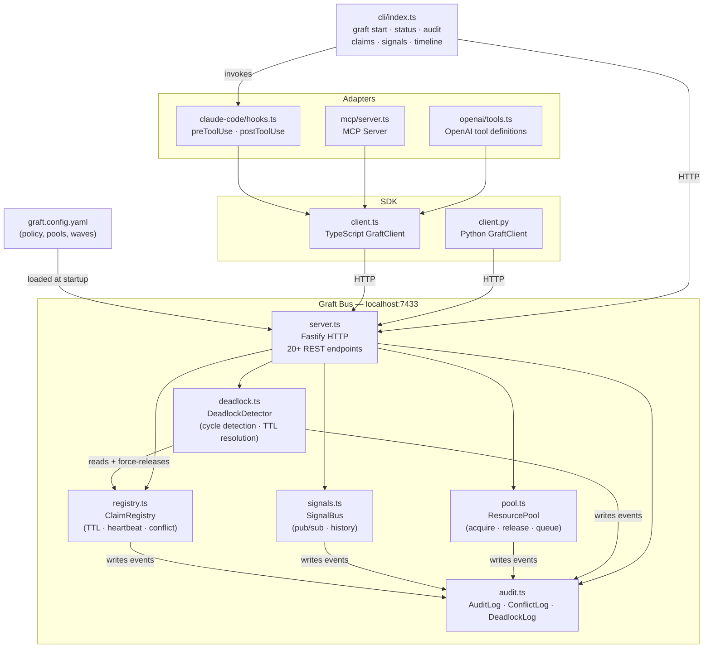
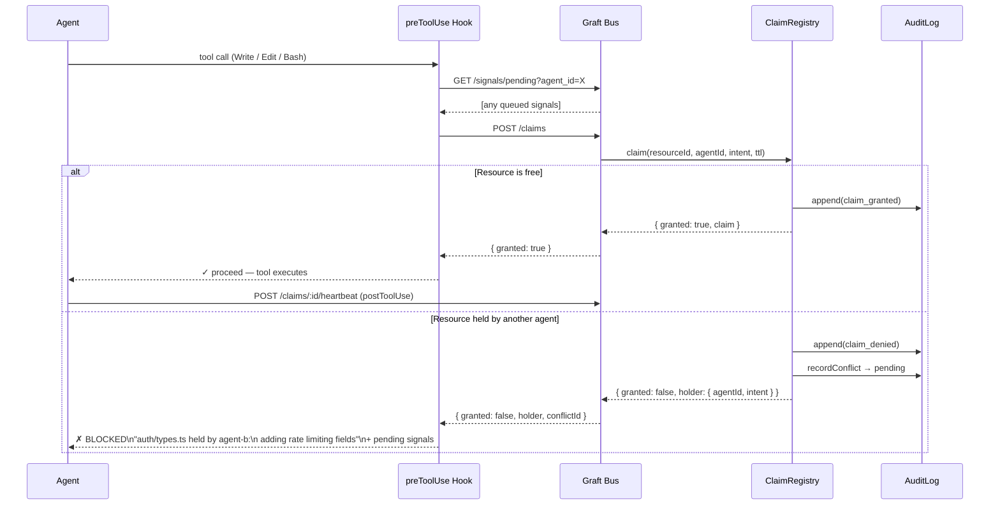
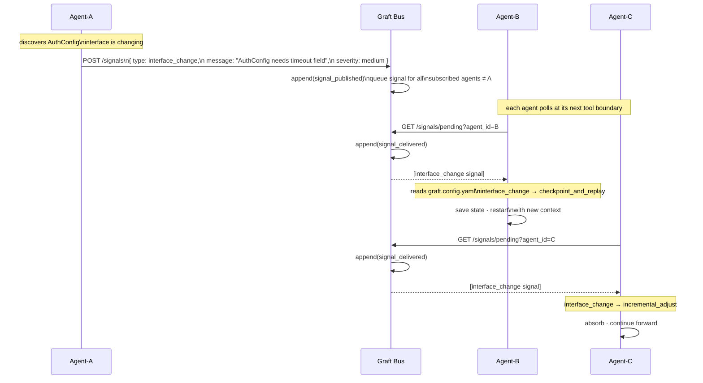
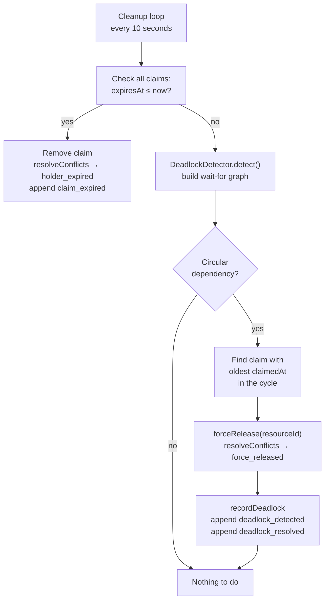
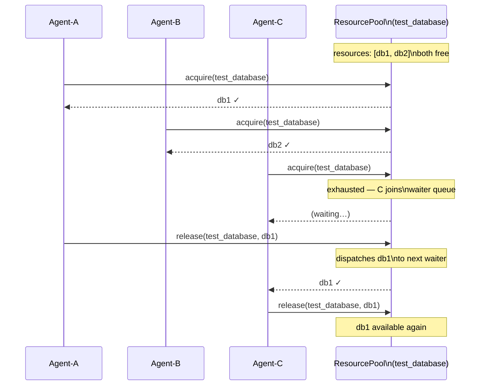
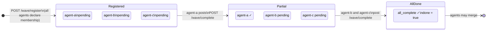
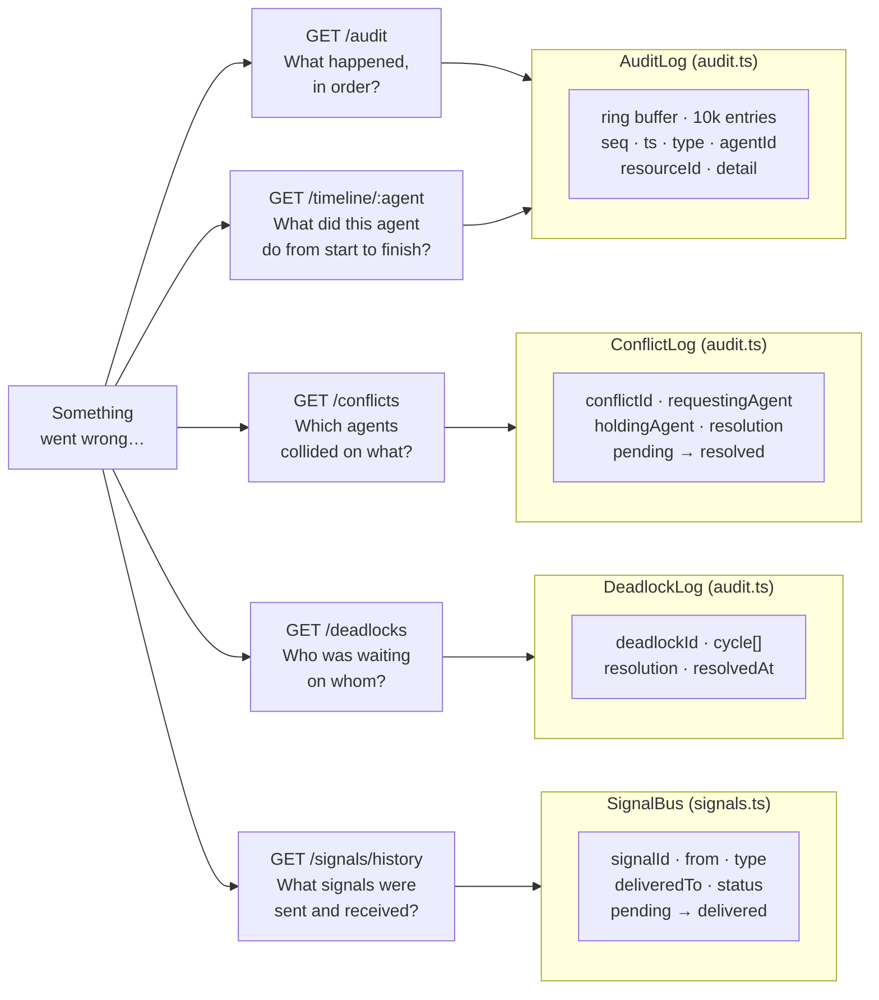

# Graft — Architecture Diagrams

---

## 1. System Architecture

How all components relate — from the bus core through SDK, adapters, and CLI.

---

## 2. Claim Flow

What happens between an agent deciding to write a file and the write actually executing.

---

## 3. Signal Propagation

How a mid-execution discovery reaches other agents without any direct agent-to-agent communication.

---

## 4. TTL Expiry & Deadlock Resolution

How the bus self-heals when agents crash or create circular waits.

---

## 5. Resource Pool

How agents share a finite set of stateful resources (test databases, dev ports) without conflicts.

---

## 6. Wave Gate

How a set of parallel agents synchronize before merging.

---

## 7. Debugging surfaces

The five observability endpoints and what each one answers.

